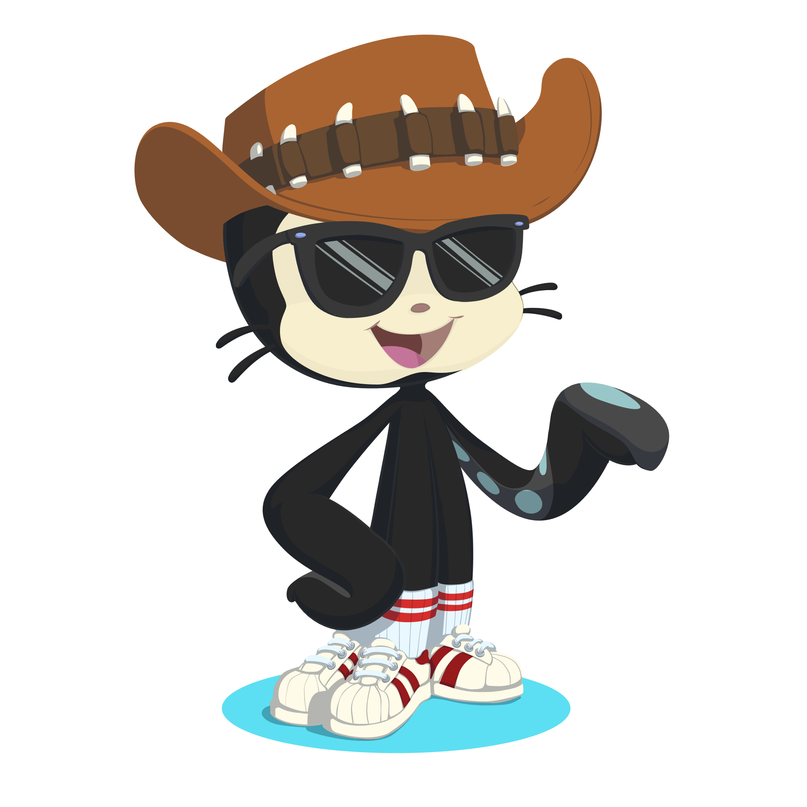

<!-- Header Section -->

  

<!-- Dynamic Status Section: Brutalist Style -->
<table align="center">
  <tr>
    <td align="center" width="400">
      
    </td>
    <td align="left">
      
       
      

        
        
      

    </td>
  </tr>
</table>

---

###  [System.Bio]

- **Education**: 🎓 Software Engineering @ **UTEC** (Peru)
- **Focus**: ⚡ React & Distributed Systems
- **Security**: 🛡️ Vulnerability Analysis & Algorithms
- **Logic**: ♟️ Competitive Chess Player

---

###  [Environment.Stack]

<table align="center">
  <tr>
    <td valign="top" width="25%">
      <h4 align="center">Frontend</h4>
      

        
      

    </td>
    <td valign="top" width="25%">
      <h4 align="center">Backend & DB</h4>
      

        
      

    </td>
    <td valign="top" width="25%">
      <h4 align="center">Low-Level</h4>
      

        
      

    </td>
    <td valign="top" width="25%">
      <h4 align="center">DevOps & Tools</h4>
      

        
      

    </td>
  </tr>
</table>

---

###  [Analytics.Dashboard]

  <table border="0">
    <tr>
      <td>
        
      </td>
      <td>
        
      </td>
    </tr>
    <tr>
      <td colspan="2" align="center">
        
      </td>
    </tr>
  </table>

---

###  [Workflow.Contributions]

  

  

  <code>Status: [OPTIMIZED]</code>

